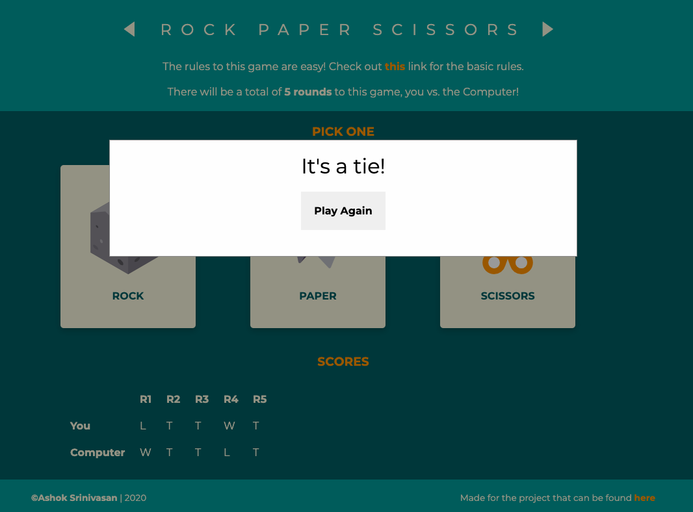

# Rock-Paper-Scissors
One of the first few JavaScript projects I will be taking on
This project is a take on the traditional rock paper scissors game, details of which can be found [here](https://en.wikipedia.org/wiki/Rock%E2%80%93paper%E2%80%93scissors).

## Motivation
I started out with the very informative courses at [The Odin Project](https://www.theodinproject.com/courses/web-development-101) and have begun with **Web Development 101**. This part was one of the many sub-projects I shall be taking on in the **Javascript Basics** portion. The entire exercise is proving to be a very good learning experience.

## Screenshots




## Tech/Framewroks Used
HTML5, CSS3 and Javascript

## Features
* Clean minimal design
* Material design cards
* Harmonius colours
* Executes the requirements of the game perfectly

## Code Example
Below is one of the main functions in Javascript used to find the outcome of a single round:

```
function computerPlay(playerSelection){
    sel=selection
    let arr=['rock','paper','scissors']
    let computerSelection=randomselect(arr)

    if(computerSelection===playerSelection){
        return ['T','-1']
    }
    else{
        if(computerSelection==='rock'){
            if(sel==='paper'){
                return ['W','1']
            }
            else if(sel==='scissors'){
                return ['L','0']
            }
        }
        else if(computerSelection==='paper'){
            if(sel==='rock'){
                return ['L','0']
            }
            else if(sel==='scissors'){
                return ['W','1']
            }
        }
        else if(computerSelection==='scissors'){
            if(sel==='rock'){
                return ['W','1']
            }
            else if(sel==='paper'){
                return ['L','0']
            }
        }
    }

}
```
## Play the game
You can also play the game [here](https://ashoksrinivasan96.github.io/Rock-paper-scissors/)

## Credits
**©Ashok Srinivasan| 2020**

Made for the project that can be found [here](https://www.theodinproject.com/courses/web-development-101/lessons/rock-paper-scissors)
